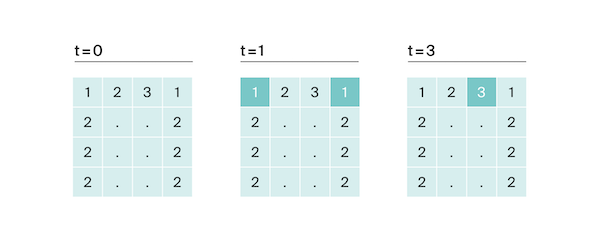

# Ловкость рук

| Ограничение времени | Ограничение памяти |
|---------------------|--------------------|
| 1 секунда           | 64Mb               |

Игра «Тренажёр для скоростной печати» представляет собой поле из клавиш 4x4. В нём на каждом раунде появляется конфигурация цифр и точек. На клавише написана либо точка, либо цифра от 1 до 9. 
В момент времени $t$ игрок должен одновременно нажать на все клавиши, на которых написана цифра $t$. Гоша и Тимофей могут нажать в один момент времени на $k$ клавиш каждый. Если в момент времени $t$ нажаты все нужные клавиши, то игроки получают 1 балл. 
 
Найдите число баллов, которое смогут заработать Гоша и Тимофей, если будут нажимать на клавиши вдвоём.

## Формат ввода

В первой строке дано целое число $k (1 ≤ k ≤ 5)$. 
В четырёх следующих строках задан вид тренажёра — по 4 символа в каждой строке. Каждый символ – либо точка, либо цифра от 1 до 9. Символы одной строки идут подряд и не разделены пробелами.

## Формат вывода

Выведите единственное число — максимальное количество баллов, которое смогут набрать Гоша и Тимофей.

### Пример 1

| Ввод                                        | Вывод |
|---------------------------------------------|-------|
| `3` `1231` `2..2` `2..2` `2..2` | 2     |

### Пример 2

| Ввод                                        | Вывод |
|---------------------------------------------|-------|
| `4` `1111` `9999` `1111` `9911` | 1     |

### Пример 3

| Ввод                              | Вывод |
|-----------------------------------|-------|
| `4` `1111` `1111` `1111` `1111` | 0     |